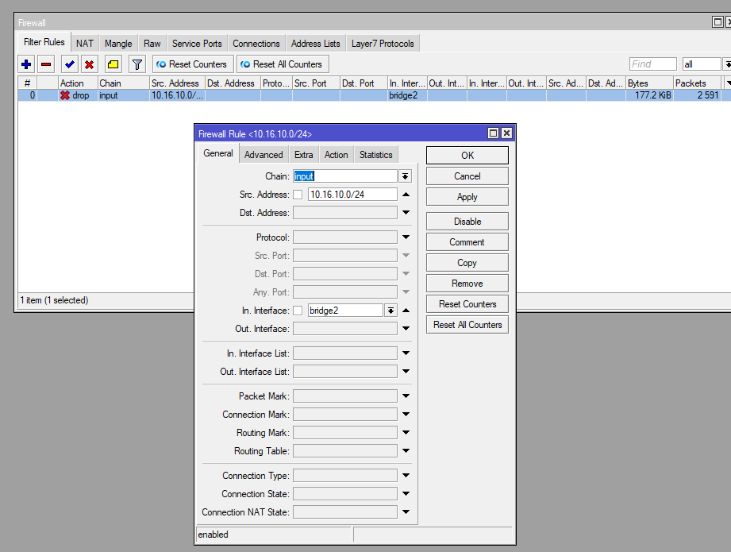

# LAB-19-Bridging-firewall
Minggu 17 Agustus 2025

# Bridging Firewall  
  
  

1. Buat DHCP Client ke interface yang terhubung ke internet untuk akses internet di **IP > DHCP CLIENT**.  
  
2. Buat Bridge untuk Memisahkan Jaringan Admin dan Client, di **Bridge > add**.  
    
3. Memasukkan Port ke Bridge di **Bridge > Ports > add**.   
    
4. Pasang IP static ke Masing-Masing Bridge, **IP > Address > add**.   
   
5. Buat DHCP server untuk setiap bridge interface, **IP > DHCP SERVER > DHCP SETUP**.  
  
6. Aktifkan Firewall NAT agar jaringan lokal bisa mengakses internet, **IP > FIREWALL > NAT> ADD**.  
  
7. Tambahkan Firewall Filter untuk Membatasi Hak Akses Client, **IP > FIREWALL > FILTER RULES > ADD**.  
  
8. Tes masing-masing port, dan cek apakah port client masi bisa login ke winbox atau tidak. Kita coba dulu di interface client.  
  
9. Sekarang coba pake interface admin.
  

# Pembahasan 
**Chain**
Di firewall Mikrotik ada beberapa rantai (chain) yang menentukan alur lalu lintas paket:
- input = untuk paket yang masuk ke router itu sendiri. Contoh: login ke Winbox, WebFig, SSH.
- forward = untuk paket yang melewati router, dari satu jaringan ke jaringan lain. Contoh: client LAN ke internet.
- output = untuk paket yang keluar dari router. Contoh: router update NTP.
- srcnat = khusus di NAT, untuk mengubah source address (biasanya supaya LAN bisa keluar internet).
- dstnat = khusus di NAT, untuk redirect traffic masuk (biasanya port forwarding).

# Kesimpulan 
  Dengan menerapkan bridging-firewall pada Mikrotik, administrator dapat mengendalikan lalu lintas antar-port dalam satu bridge secara lebih aman. Meskipun semua interface tergabung dalam satu jaringan (bridge), aturan firewall tetap dapat membatasi akses tertentu, misalnya memblokir client agar tidak bisa login ke router, atau hanya mengizinkan jaringan tertentu yang terhubung ke bridge.
